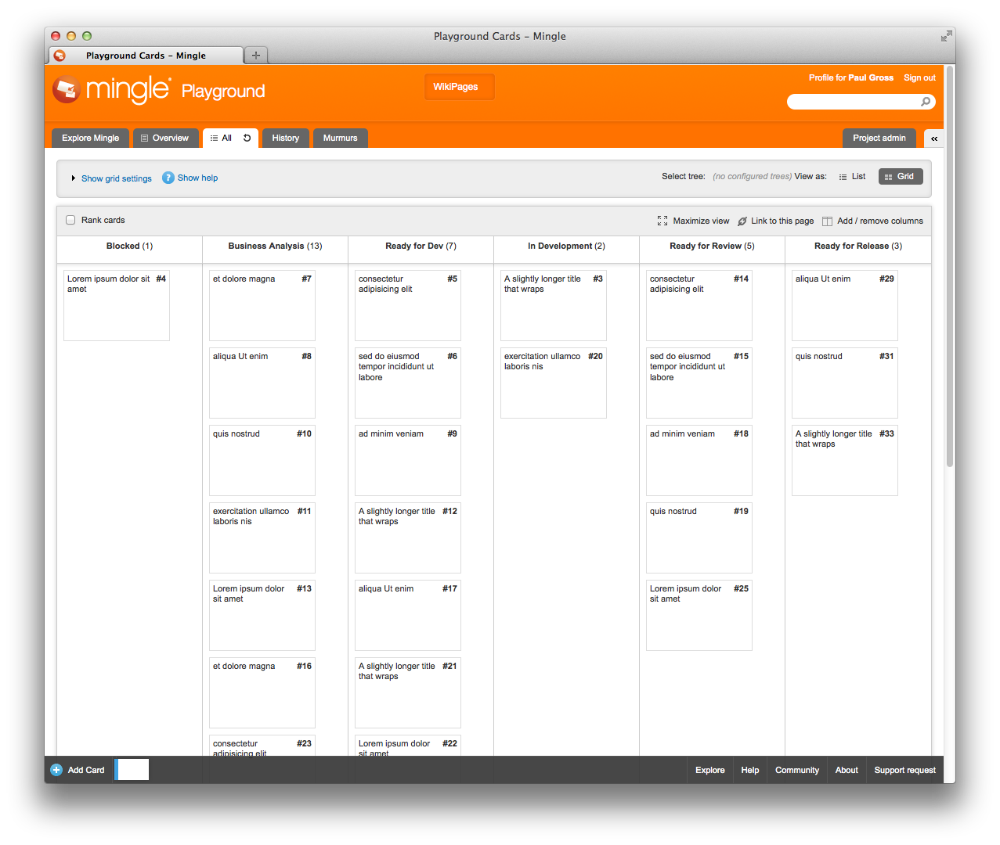
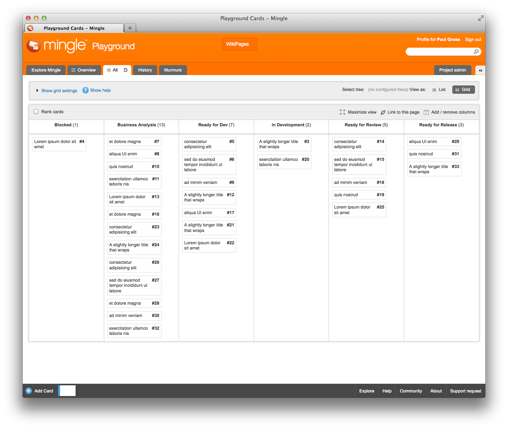

Remove Mingle Card Height
=========================

This is a [Greasemonkey](https://addons.mozilla.org/en-US/firefox/addon/greasemonkey/) script which changes the height of cards on a card wall. It removes a bunch of empty space in favor of a more dense view.

For exmaple, this:

becomes this:

## Installation

1. Make sure you have [Greasemonkey](https://addons.mozilla.org/en-US/firefox/addon/greasemonkey/) installed.
2. Fork this repo.
3. Edit remove_mingle_card_height.user.js and change the @include line to match your mingle installation. For example: `// @include     https://mingle.example.com*`
4. Once you push the code, click on the `remove_mingle_card_height.user.js` file and then click "Raw."
5. This should prompt you to install the script.
